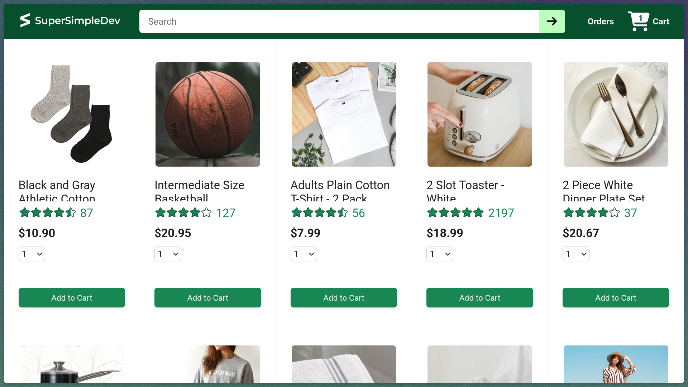
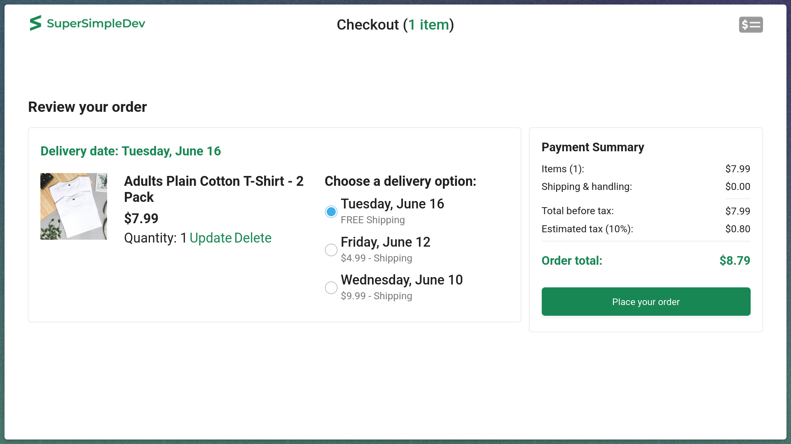
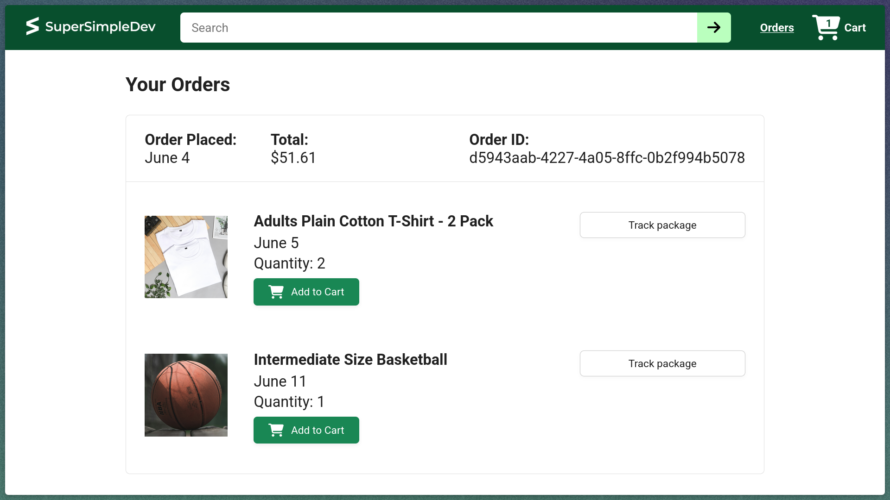
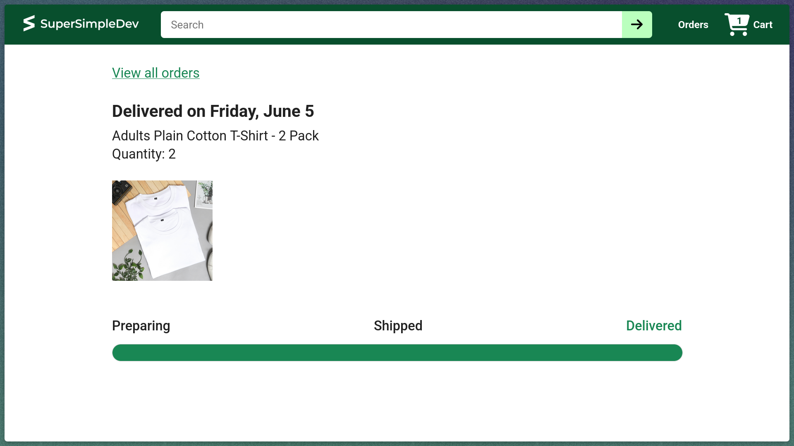

# Ecommerce Project

Frontend for a Node-based ecommerce app. It loads products, cart, checkout, orders, and tracking data from a backend and updates the page immediately as users add items, change quantities, or switch shipping options.

## Tech stack

      

- React 19
- Vite
- JavaScript
- HTML
- CSS
- Node.js (backend)
- ESLint

## Setup

```bash
npm install
npm run dev
```

Then open the browser at `http://localhost:5173`.

## Backend

The backend repository is available at [github.com/anvay69/ecommerce-backend](https://github.com/anvay69/ecommerce-backend).

### Running the backend

1. Clone the repository:
```bash
git clone https://github.com/anvay69/ecommerce-backend.git
cd ecommerce-backend
```

2. Install dependencies:
```bash
npm install
```

3. Start the backend server:
```bash
npm start
```

The backend will run on `http://localhost:3000`.

Vite proxies `/api` and `/images` to that host.

## Test

```bash
npx vitest
```

## Screenshots

<table>
  <tr>
    <td></td>
    <td></td>
  </tr>
  <tr>
    <td></td>
    <td></td>
  </tr>
</table>

## Features

- Product catalog with search and rating display
- Add to cart with quantity selection and instant cart badge update
- Checkout page with delivery options, tax, and total cost recalculated live
- Inline cart item updates and delete actions
- Order history list with product details
- Order tracking page with delivery progress bar and status steps

## Overview

This frontend loads all data from a Node backend and renders it with React. It uses client-side routing for home, checkout, orders, and tracking pages. The app keeps cart totals, delivery options, and order progress synced with the backend each time the user interacts.

## How it works

- Home page loads product data and search state from the backend.
- Cart actions send API requests and refresh cart state immediately.
- Checkout pulls delivery options and payment summary from the backend, then updates totals live.
- Orders page reads the purchase history and displays the order details.
- Tracking page calculates progress by comparing current time against order timestamps.

## Pages

- `/` — product catalog and search
- `/checkout` — cart review, shipping options, payment summary
- `/orders` — past orders and order details
- `/tracking/:orderId/:productId` — delivery progress for a single ordered item

